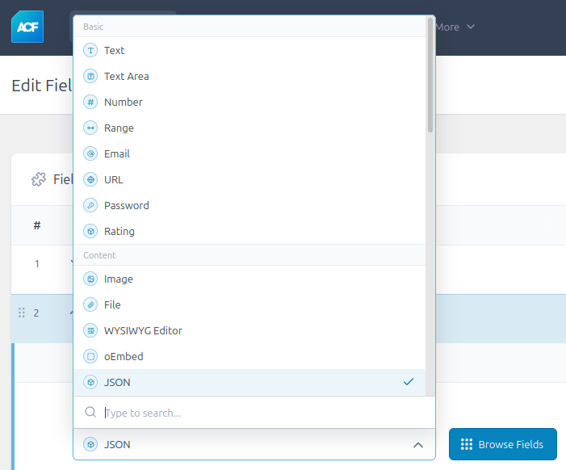
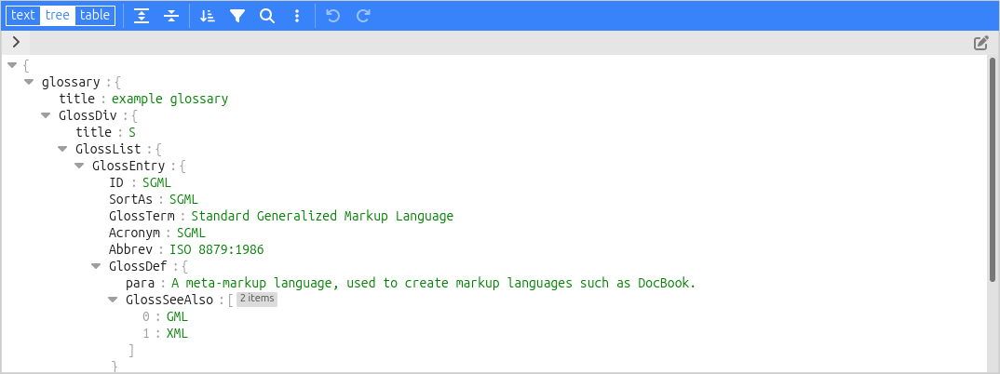

[](https://github.com/jpfleury/acf-json-field/releases)

# ACF JSON Field

ACF JSON Field is a WordPress plugin that adds a new ACF field type for editing, saving, and displaying JSON data.

## Installation

- Download the [latest version from GitHub](https://github.com/jpfleury/acf-json-field/releases/latest/download/acf-json-field.zip).

- Extract the archive and copy the folder (`acf-json-field`) into your WordPress plugins directory (`/wp-content/plugins/`).

- In your WordPress admin dashboard (`https://.../wp-admin/plugins.php`), enable the **ACF JSON Field** plugin. Note: You can enable auto-updates.

## Usage

Go to the ACF administration page (`https://.../wp-admin/edit.php?post_type=acf-field-group`), create a new field group, and choose the **JSON** field type. Adjust the field settings as needed.



When editing a post or page with a JSON field, a dedicated editor will allow users to modify the JSON content:



### Utilities and shortcode

The plugin provides utility methods to retrieve, format, and set JSON data for a given ACF field, as well as a shortcode for displaying this data on the front end.

To retrieve JSON data, use the `get_json_field` method:

```php
use \AcfJsonField\JsonUtils;

// Retrieve the JSON data as a PHP type (array, boolean, etc.) for the current post
$json_data = JsonUtils::get_json_field('field_name_or_key');
$json_data = JsonUtils::get_json_field('field_name_or_key', false);
$json_data = JsonUtils::get_json_field('field_name_or_key', null);

// For a specific post ID
$json_data = JsonUtils::get_json_field('field_name_or_key', 125);

// For the current user
$json_data = JsonUtils::get_json_field('field_name_or_key', 'user');

// For a specific user
$json_data = JsonUtils::get_json_field('field_name_or_key', 'user_24');

// Retrieve the JSON data as an HTML-formatted string
$json_html = JsonUtils::get_json_field('field_name_or_key', $id, 'html');
```

Alternatively:

```php
$json_data = \AcfJsonField\JsonUtils::get_json_field('field_name_or_key');
```

To set JSON data for a specific ACF field, use the `set_json_field` method:

```php
$php_data = ['lorem1' => 'ipsum2', 'lorem2' => 'ipsum2'];
$success = JsonUtils::set_json_field('field_name_or_key', $php_data, 125);

$json_encoded = json_encode($php_data);
$success = JsonUtils::set_json_field('field_name_or_key', $json_encoded, 125, true);
```

To encode PHP data into a JSON string with pretty-print formatting, use the `encode` method:

```php
$json_encoded = JsonUtils::encode($php_data);
```

To display the field value on the front end, use the `acf_json_field` shortcode. By default, it fetches the field value from the current post:

	[acf_json_field field="field_name_or_key"]

To fetch the value from a different post, specify the `id`:

	[acf_json_field field="field_name_or_key" id="125"]

If the field is linked to the current user:

	[acf_json_field field="field_name_or_key" id="user"]

Or for a specific user:

	[acf_json_field field="field_name_or_key" id="user_24"]

## License

ACF JSON Field: A WordPress plugin that adds a new ACF field for editing, saving, and displaying JSON data

Copyright (C) 2024  Jean-Philippe Fleury

This program is free software: you can redistribute it and/or modify
it under the terms of the GNU General Public License as published by
the Free Software Foundation, either version 3 of the License, or
(at your option) any later version.

This program is distributed in the hope that it will be useful,
but WITHOUT ANY WARRANTY; without even the implied warranty of
MERCHANTABILITY or FITNESS FOR A PARTICULAR PURPOSE.  See the
GNU General Public License for more details.

You should have received a copy of the GNU General Public License
along with this program.  If not, see <https://www.gnu.org/licenses/>.

### Third-party code

- ACF JSON Field uses [Plugin Update Checker](https://github.com/YahnisElsts/plugin-update-checker) under the [MIT License](https://github.com/YahnisElsts/plugin-update-checker/blob/master/license.txt) to manage auto-updates within the WordPress plugin manager.
